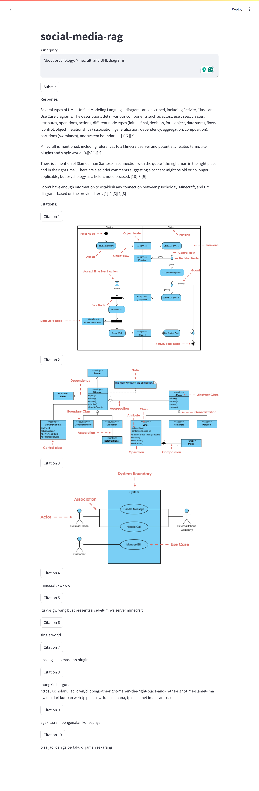

# social-media-rag

> A simple social media with RAG application using Beeper Matrix and LangChain.

## Features

- Aggregating up to 10 social media (i.e., Discord, Slack, WhatsApp, etc.) privately using the Beeper Matrix protocol.
- Aggregated social media image and text data are used by RAG (retrieval augmented generation) to answer user queries.
- The RAG implementation is using LangChain with Milvus, Cohere, and Google AI.
- The application user interface is created with Streamlit.

## Tutorial

### 1. Install the dependencies.

```bash
uv pip install -e . -U
```

### 2. Run the app.

```bash
streamlit run app.py
```

### 3. Sidebar configurations.

- Input API credentials.
- Input Beeper Matrix credentials.
- Input Room ID(s).
- Input settings.
- Click on the "Sync" button.
- Optionally, click "Reset" button to clear the data.

### 5. Question and Answer.

- Input your query in the text box.
- Click on the "Submit" button.
- Click citation button to view citation details.

## Demonstration

